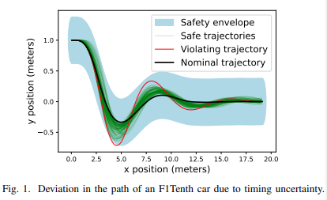
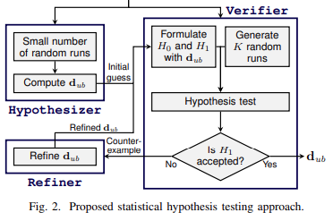
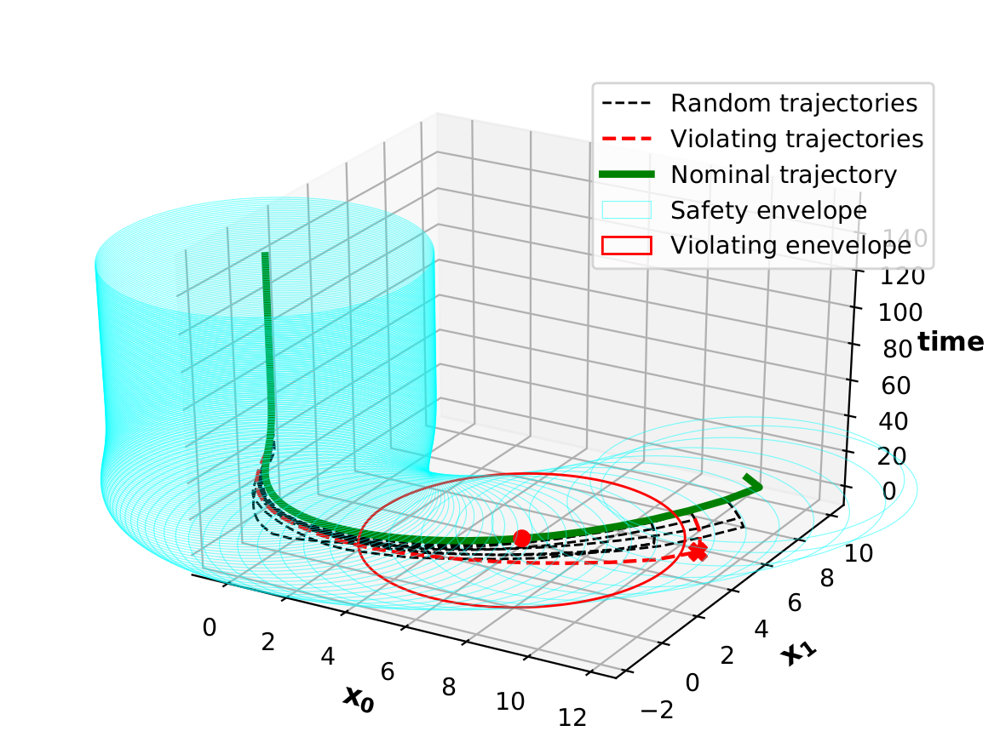

# `StatDev`: Statistical Hypothesis Testing of Controller Implementations Under Timing Uncertainties

The tool is based on the following work:

**Statistical Hypothesis Testing of Controller Implementations Under Timing Uncertainties**. Bineet Ghosh, Clara Hobbs, Shengjie Xu, Parasara Sridhar Duggirala, James H. Anderson, P. S. Thiagarajan, Samarjit Chakraborty. In: The 28th IEEE International Conference on Embedded and Real-Time Computing Systems and Applications (RTCSA). 2022. _(To appear)_.

_Note: We see some latex rendering issues of the README.md file from GitHub's side. We kindly refer the user to the [README.pdf](https://github.com/bineet-coderep/StatJitteryScheduler/blob/main/README.pdf) file to avoid any confusion._

Performing timing analysis for such safety critical control software tasks with heterogeneous hardware is becoming increasingly challenging. Consequently, a number of recent papers have addressed the problem of stability analysis of feedback control loops in the presence of timing uncertainties (_cf._, deadline misses). Here, we address a different class of safety properties, _viz._, whether the system trajectory deviates too much from the nominal trajectory, with the latter computed for the ideal timing behavior. This has been illustrated on an F1Tenth car example in the following figure.



## Methodology

Verifying such quantitative safety properties involves performing a reachability analysis that is computationally intractable, or is too conservative. To alleviate these problems we propose to provide statistical guarantees over behavior of control systems with timing uncertainties. More specifically, we present a Bayesian hypothesis testing method based on Jeffreys’s Bayes factor test that estimates deviations from a nominal or ideal behavior. We show that our analysis can provide, with high confidence, tighter estimates of the deviation from nominal behavior than using known reachability based methods. 

In our statistical hypothesis testing framework in Fig. 2, to test if a given $\mathbf{d}_{ub}$ is an upper bound for the maximum deviation. 

*  $H_0$ (_null hypothesis_): Asserts that with at most probability $c$, a randomly chosen trajectory will have a deviation bounded by $\mathbf{d}_{ub}$ .
* $H_1$ (_alternative hypothesis_): Asserts that with at least probability $c$, a randomly chosen run will have a deviation that is bounded by $\mathbf{d}_{ub}$. 

We then use the Jeffreys’s Bayes factor test to decide between these two hypotheses. An important consequence of our test is, when the samples we have drawn do not support the alternative hypothesis, they will contain a counterexample with a deviation that exceeds the current value of $\mathbf{d}_{ub}$. This will lead to the next iteration of hypothesis testing based on a new, larger $\mathbf{d}_{ub}$. In this sense, our method is driven by a counterexample guided refinement strategy to eventually accept the alternative hypothesis (see Fig. 2). 



## Installation

### Dependencies

- [`Python 3.9.x`](https://www.python.org/)
- [`NumPy`](https://numpy.org/)
- [`SciPy`](https://scipy.org/)
- [`mpmath`](https://mpmath.org/)
- [`seaborn`](https://seaborn.pydata.org/)
- [`pandas`](https://pandas.pydata.org/)
- [`mpl_toolkits`](https://matplotlib.org/1.3.0/mpl_toolkits/index.html)

### Downloading `StatDev`

1. Download the repository to your desired location `/my/location/`:

   * ```shell
     git clone https://github.com/bineet-coderep/StatJitteryScheduler.git
     ```

2. Once the repository is downloaded, please open `~/.bashrc`, and add the line `export STAT_SCHDLR_ROOT_DIR=/my/location/StatJitteryScheduler/`, mentioned in the following steps:

   * ```shell
     vi ~/.baschrc
     ```

3. Once `.bashrc` is opened, please add the location, where the tool was downloaded, to a path variable `MNTR_ROOT_DIR` (This step is crucial to run the tool):

   * ```shell
     export STAT_SCHDLR_ROOT_DIR=/my/location/StatJitteryScheduler/
     ```

## Running `StatDev`

Once the dependencies are installed properly, and the path variable is set, following steps should run without any error.

Following are some of the crucial functionalities offered by this prototype tool:

1. Compute the maximum deviation from the nominal behavior.
2. Given a safety specification, find a violating trajectory.
3. Analytics to provide insights on selecting confidence level (on the computed bound).

### Case studies

We offer four case studies:

1. [RC Network](https://www.abebooks.com/servlet/SearchResults?sts=t&tn=Signals+and+Linear+Systems&x=51&y=16).
2. [Electric Steering](https://drops.dagstuhl.de/opus/volltexte/2020/12384/pdf/LIPIcs-ECRTS-2020-21.pdf).
3. [Unstable Second-Order System](https://drops.dagstuhl.de/opus/volltexte/2020/12384/pdf/LIPIcs-ECRTS-2020-21.pdf).
4. [F1Tenth](http://proceedings.mlr.press/v123/o-kelly20a.html).

Here, we illustrate the Anesthesia case study, as the other one can be run in similar fashion.

1. ```shell
   cd src/
   ```

2. ```shell
   python Steering.py
   ```

Similar (not exactly the same, as it's stochastic) output should be seen:

```shell
>> Starting Main Algo.	Sched Policy:  HoldSkip-Next .	Distro:  K-Miss .	Heuristic Used:  RandSampKMiss
	>> SUB-STATUS: Computing Initial d
	* d:  4.651375979003898
	* Time Taken:  0.5086154937744141
	>> SUB-STATUS: Initial d Computed!!

	>> SUB-STATUS: Refinement Starts . . .
	>> SUB-STATUS: Iteration Number:  0
>> STATUS: Statistically Verifying . . .
	* Hypothesis Accepted:  True
	* Time Taken:  1.2872037887573242
>> STATUS: Statistically Verified!!
	>> SUB-STATUS: Refinement End . . .
	* Time Taken:  1.8150975704193115
	* Refinements Made:  0
	* Upper Bound d:  4.651375979003898
>> Main Algo Executed!!
.
.
.
>> Starting Main Algo.	Sched Policy:  HoldSkip-Next .	Distro:  K-Miss .	Heuristic Used:  RandSampKMiss
	>> SUB-STATUS: Computing Initial d
	* d:  4.651375979003898
	* Time Taken:  0.49790096282958984
	>> SUB-STATUS: Initial d Computed!!

	>> SUB-STATUS: Refinement Starts . . .
	>> SUB-STATUS: Iteration Number:  0
>> STATUS: Statistically Verifying . . .
	* Hypothesis Accepted:  True
	* Time Taken:  1.2596149444580078
>> STATUS: Statistically Verified!!
	>> SUB-STATUS: Refinement End . . .
	* Time Taken:  1.7765440940856934
	* Refinements Made:  0
	* Upper Bound d:  4.651375979003898
>> Main Algo Executed!!

```

One should see a similar plot in `/my/location/StatJitteryScheduler/output/`:


