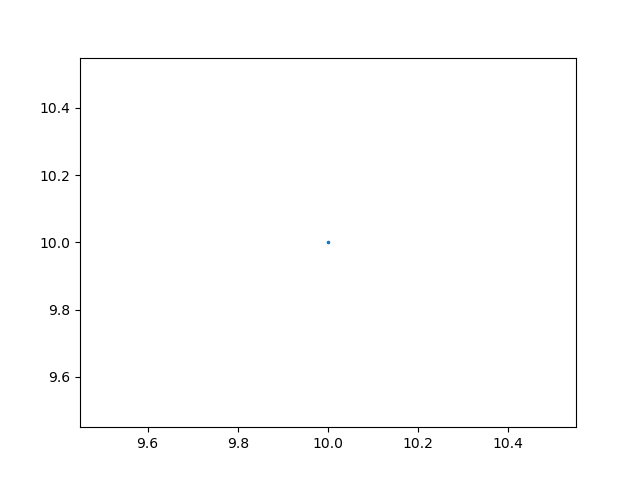

# Report: Bounded Tree Method

## Parameters

* Initial Point: (10,10).
* Maximum number of consecutive misses allowed: 5.
* Bounded Step: 5. Therefore, 32 possibilities.
* Time Bound: 150.

## Hold and Skip

```shell
>> STATUS: Computing Bounded Step Reachable Sets . . .
	>> Time Taken:  3.8147835731506348
>> STATUS: Reachable Sets Computed!!
```



## Hold and Kill

```shell
>> STATUS: Computing Bounded Step Reachable Sets . . .
	>> Time Taken:  0.4823169708251953
>> STATUS: Reachable Sets Computed!!
```


## Zero and Kill

```shell
>> STATUS: Computing Bounded Step Reachable Sets . . .
	>> Time Taken:  0.48111987113952637
>> STATUS: Reachable Sets Computed!!
```


