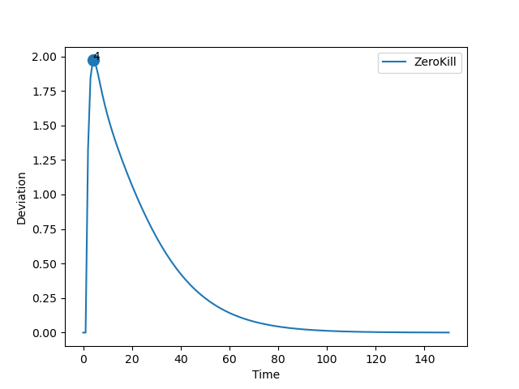
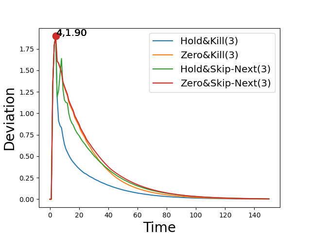
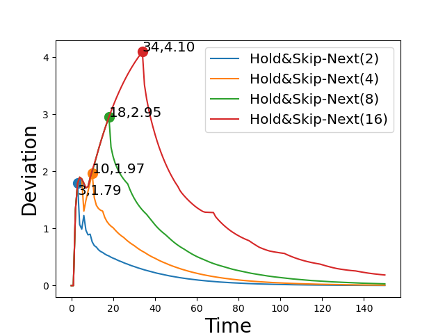
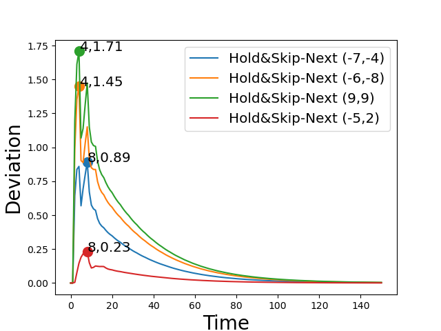

# Report: RC

## Parameters

```sh
* Initial Set: [[10,10],[10,10]]
* Time Bound: 150
```

## Report: Using Uncertain Linear Systems

* Table



* Note: Three policies were dropped due to plot skewing.

### Detailed Report

```sh
>> REPORT.	Method: ULS.	Policy:  HoldKill .
>> STATUS: Computing Reachable Sets . . .
	Time Taken:  3.6136250495910645
>> STATUS: Reachable Sets Computed!
>> STATUS: Computing Deviations . . .
	Time Taken:  2.329080820083618
>> STATUS: Deviations Computed!
	Max Deviation:  1032225.4821144971 ;	 At time step:  150
	Total Time Taken:  5.971573829650879
>> End of Report!

-----------

>> REPORT.	Method: ULS.	Policy:  ZeroKill .
>> STATUS: Computing Reachable Sets . . .
	Time Taken:  3.649709463119507
>> STATUS: Reachable Sets Computed!
>> STATUS: Computing Deviations . . .
	Time Taken:  2.235740900039673
>> STATUS: Deviations Computed!
	Max Deviation:  1.9714503127201366 ;	 At time step:  4
	Total Time Taken:  5.887566804885864
>> End of Report!

-----------

>> REPORT.	Method: ULS.	Policy:  HoldSkipAny .
>> STATUS: Computing Reachable Sets . . .
	Time Taken:  18.975404739379883
>> STATUS: Reachable Sets Computed!
>> STATUS: Computing Deviations . . .
	Time Taken:  7.158948183059692
>> STATUS: Deviations Computed!
	Max Deviation:  4.545056023539982e+25 ;	 At time step:  150
	Total Time Taken:  26.1369206905365
>> End of Report!

-----------

>> REPORT.	Method: ULS.	Policy:  ZeroSkipNext .
>> STATUS: Computing Reachable Sets . . .
	Time Taken:  19.83796763420105
>> STATUS: Reachable Sets Computed!
>> STATUS: Computing Deviations . . .
	Time Taken:  7.116084337234497
>> STATUS: Deviations Computed!
	Max Deviation:  4.545056023539982e+25 ;	 At time step:  150
	Total Time Taken:  26.956810235977173
>> End of Report!

-----------
```

## Report: Using Generalized Recurrence Relations

* Table
* Max Deadline Miss: 3



### Detailed Report

```sh
>> REPORT.	Method: Recurrence Relation.	Policy:  HoldKill .	Max Deadline Miss:  3
>> STATUS: Computing Reachable Sets . . .
	Time Taken:  0.2652614116668701
>> STATUS: Reachable Sets Computed!
>> STATUS: Computing Deviations . . .
	Time Taken:  0.48089122772216797
>> STATUS: Deviations Computed!
	Max Deviation:  1.8975665908289183 ;	 At time step:  4
	Total Time Taken:  0.770838737487793
>> End of Report!

-----------

>> REPORT.	Method: Recurrence Relation.	Policy:  ZeroKill .	Max Deadline Miss:  3
>> STATUS: Computing Reachable Sets . . .
	Time Taken:  0.27864575386047363
>> STATUS: Reachable Sets Computed!
>> STATUS: Computing Deviations . . .
	Time Taken:  0.4698023796081543
>> STATUS: Deviations Computed!
	Max Deviation:  1.8975665908289183 ;	 At time step:  4
	Total Time Taken:  0.7502467632293701
>> End of Report!

-----------

>> REPORT.	Method: Recurrence Relation.	Policy:  HoldSkipAny .	Max Deadline Miss:  3
>> STATUS: Computing Reachable Sets . . .
	Time Taken:  0.4742562770843506
>> STATUS: Reachable Sets Computed!
>> STATUS: Computing Deviations . . .
	Time Taken:  0.9088175296783447
>> STATUS: Deviations Computed!
	Max Deviation:  1.897566590828919 ;	 At time step:  4
	Total Time Taken:  1.38521409034729
>> End of Report!

-----------

>> REPORT.	Method: Recurrence Relation.	Policy:  ZeroSkipNext .	Max Deadline Miss:  3
>> STATUS: Computing Reachable Sets . . .
	Time Taken:  0.46997666358947754
>> STATUS: Reachable Sets Computed!
>> STATUS: Computing Deviations . . .
	Time Taken:  0.9221920967102051
>> STATUS: Deviations Computed!
	Max Deviation:  1.897566590828919 ;	 At time step:  4
	Total Time Taken:  1.3943507671356201
>> End of Report!

-----------
```

## Report: Using Generalized Recurrence Relations on Hold-Skip-Next Varying Misses

* Comparing the effect of deadline misses



### Detailed Report

```sh
>> REPORT.	Method: Recurrence Relation.	Policy:  HoldSkipAny .	Max Deadline Miss:  2
>> STATUS: Computing Reachable Sets . . .
	Time Taken:  0.34388113021850586
>> STATUS: Reachable Sets Computed!
>> STATUS: Computing Deviations . . .
	Time Taken:  0.6985325813293457
>> STATUS: Deviations Computed!
	Max Deviation:  1.791379953474675 ;	 At time step:  3
	Total Time Taken:  1.0676679611206055
>> End of Report!

-----------

>> REPORT.	Method: Recurrence Relation.	Policy:  HoldSkipAny .	Max Deadline Miss:  4
>> STATUS: Computing Reachable Sets . . .
	Time Taken:  0.5847616195678711
>> STATUS: Reachable Sets Computed!
>> STATUS: Computing Deviations . . .
	Time Taken:  1.1577928066253662
>> STATUS: Deviations Computed!
	Max Deviation:  1.9697615725709685 ;	 At time step:  10
	Total Time Taken:  1.7447214126586914
>> End of Report!

-----------

>> REPORT.	Method: Recurrence Relation.	Policy:  HoldSkipAny .	Max Deadline Miss:  8
>> STATUS: Computing Reachable Sets . . .
	Time Taken:  1.042875051498413
>> STATUS: Reachable Sets Computed!
>> STATUS: Computing Deviations . . .
	Time Taken:  2.2655797004699707
>> STATUS: Deviations Computed!
	Max Deviation:  2.9524022285040594 ;	 At time step:  18
	Total Time Taken:  3.3111865520477295
>> End of Report!

-----------

>> REPORT.	Method: Recurrence Relation.	Policy:  HoldSkipAny .	Max Deadline Miss:  16
>> STATUS: Computing Reachable Sets . . .
	Time Taken:  2.2474124431610107
>> STATUS: Reachable Sets Computed!
>> STATUS: Computing Deviations . . .
	Time Taken:  4.281951189041138
>> STATUS: Deviations Computed!
	Max Deviation:  4.09577302012779 ;	 At time step:  34
	Total Time Taken:  6.531841039657593
>> End of Report!

-----------
```

## Report: Using Generalized Recurrence Relations on Hold-Skip-Next Varying Initial States

* Comparing the effect of initial sets.
* Max deadline: 3



### Detailed Report

```sh
>> REPORT.	Method: Recurrence Relation.	Policy:  HoldSkipAny .	Max Deadline Miss:  3
>> STATUS: Computing Reachable Sets . . .
	Time Taken:  0.47214484214782715
>> STATUS: Reachable Sets Computed!
>> STATUS: Computing Deviations . . .
	Time Taken:  0.8895363807678223
>> STATUS: Deviations Computed!
	Max Deviation:  0.8930532561794741 ;	 At time step:  8
	Total Time Taken:  1.3947181701660156
>> End of Report!
Init Set:  -7 , -4

-----------

>> REPORT.	Method: Recurrence Relation.	Policy:  HoldSkipAny .	Max Deadline Miss:  3
>> STATUS: Computing Reachable Sets . . .
	Time Taken:  0.474841833114624
>> STATUS: Reachable Sets Computed!
>> STATUS: Computing Deviations . . .
	Time Taken:  0.9601469039916992
>> STATUS: Deviations Computed!
	Max Deviation:  1.4511375650466851 ;	 At time step:  4
	Total Time Taken:  1.4370908737182617
>> End of Report!
Init Set:  -6 , -8

-----------

>> REPORT.	Method: Recurrence Relation.	Policy:  HoldSkipAny .	Max Deadline Miss:  3
>> STATUS: Computing Reachable Sets . . .
	Time Taken:  0.4792180061340332
>> STATUS: Reachable Sets Computed!
>> STATUS: Computing Deviations . . .
	Time Taken:  0.9001927375793457
>> STATUS: Deviations Computed!
	Max Deviation:  1.7078099317460271 ;	 At time step:  4
	Total Time Taken:  1.381425142288208
>> End of Report!
Init Set:  9 , 9

-----------

>> REPORT.	Method: Recurrence Relation.	Policy:  HoldSkipAny .	Max Deadline Miss:  3
>> STATUS: Computing Reachable Sets . . .
	Time Taken:  0.467822790145874
>> STATUS: Reachable Sets Computed!
>> STATUS: Computing Deviations . . .
	Time Taken:  0.9014711380004883
>> STATUS: Deviations Computed!
	Max Deviation:  0.23015556395591746 ;	 At time step:  8
	Total Time Taken:  1.3715903759002686
>> End of Report!
Init Set:  -5 , 2

-----------
```

