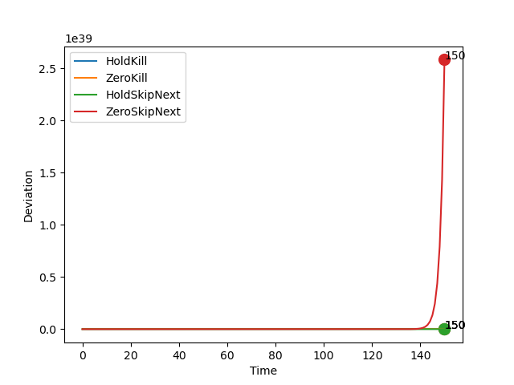
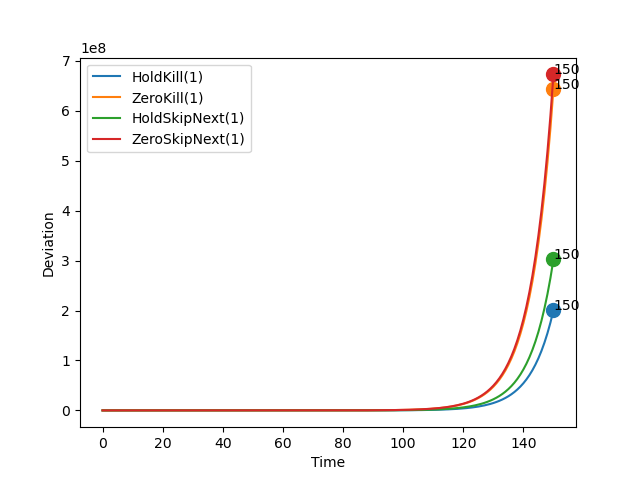
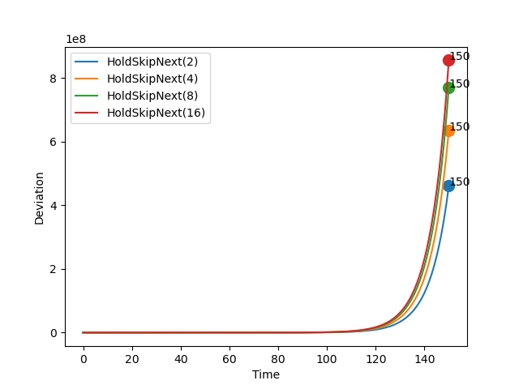
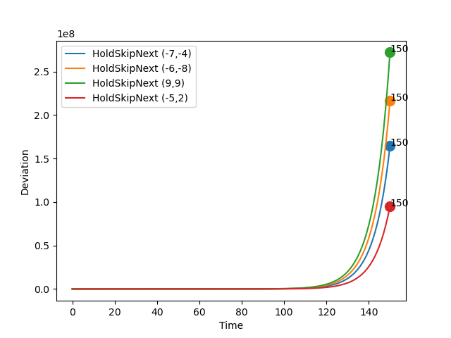

# Report: Steering

## Parameters

```sh
* Initial Set: [[10,10],[10,10]]
* Time Bound: 150
```

## Report: Using Uncertain Linear Systems

* Table



### Detailed Report

```sh
>> REPORT.	Method: ULS.	Policy:  HoldKill .
>> STATUS: Computing Reachable Sets . . .
	Time Taken:  8.910301923751831
>> STATUS: Reachable Sets Computed!
>> STATUS: Computing Deviations . . .
	Time Taken:  4.140619993209839
>> STATUS: Deviations Computed!
	Max Deviation:  7.609597282281613e+18 ;	 At time step:  150
	Total Time Taken:  13.072353601455688
>> End of Report!

-----------

>> REPORT.	Method: ULS.	Policy:  ZeroKill .
>> STATUS: Computing Reachable Sets . . .
	Time Taken:  8.46167778968811
>> STATUS: Reachable Sets Computed!
>> STATUS: Computing Deviations . . .
	Time Taken:  4.189613342285156
>> STATUS: Deviations Computed!
	Max Deviation:  6641360.698514424 ;	 At time step:  150
	Total Time Taken:  12.653410196304321
>> End of Report!

-----------

>> REPORT.	Method: ULS.	Policy:  HoldSkipAny .
>> STATUS: Computing Reachable Sets . . .
	Time Taken:  32.29182982444763
>> STATUS: Reachable Sets Computed!
>> STATUS: Computing Deviations . . .
	Time Taken:  10.309853792190552
>> STATUS: Deviations Computed!
	Max Deviation:  1.6137219538841787e+36 ;	 At time step:  150
	Total Time Taken:  42.604286670684814
>> End of Report!

-----------

>> REPORT.	Method: ULS.	Policy:  ZeroSkipNext .
>> STATUS: Computing Reachable Sets . . .
	Time Taken:  32.360183238983154
>> STATUS: Reachable Sets Computed!
>> STATUS: Computing Deviations . . .
	Time Taken:  9.95075511932373
>> STATUS: Deviations Computed!
	Max Deviation:  2.5822333933482065e+39 ;	 At time step:  150
	Total Time Taken:  42.31368112564087
>> End of Report!

-----------
```

## Report: Using Generalized Recurrence Relations

* Table
* Max Deadline Miss: 1



### Detailed Report

```sh
>> REPORT.	Method: Recurrence Relation.	Policy:  HoldKill .	Max Deadline Miss:  1
>> STATUS: Computing Reachable Sets . . .
	Time Taken:  0.19556522369384766
>> STATUS: Reachable Sets Computed!
>> STATUS: Computing Deviations . . .
	Time Taken:  0.3530235290527344
>> STATUS: Deviations Computed!
	Max Deviation:  200641637.72217256 ;	 At time step:  150
	Total Time Taken:  0.5767507553100586
>> End of Report!

-----------

>> REPORT.	Method: Recurrence Relation.	Policy:  ZeroKill .	Max Deadline Miss:  1
>> STATUS: Computing Reachable Sets . . .
	Time Taken:  0.20116925239562988
>> STATUS: Reachable Sets Computed!
>> STATUS: Computing Deviations . . .
	Time Taken:  0.34436988830566406
>> STATUS: Deviations Computed!
	Max Deviation:  644430680.9656265 ;	 At time step:  150
	Total Time Taken:  0.5473942756652832
>> End of Report!

-----------

>> REPORT.	Method: Recurrence Relation.	Policy:  HoldSkipAny .	Max Deadline Miss:  1
>> STATUS: Computing Reachable Sets . . .
	Time Taken:  0.3221762180328369
>> STATUS: Reachable Sets Computed!
>> STATUS: Computing Deviations . . .
	Time Taken:  0.6218600273132324
>> STATUS: Deviations Computed!
	Max Deviation:  302324448.03611153 ;	 At time step:  150
	Total Time Taken:  0.9461166858673096
>> End of Report!

-----------

>> REPORT.	Method: Recurrence Relation.	Policy:  ZeroSkipNext .	Max Deadline Miss:  1
>> STATUS: Computing Reachable Sets . . .
	Time Taken:  0.32520556449890137
>> STATUS: Reachable Sets Computed!
>> STATUS: Computing Deviations . . .
	Time Taken:  0.5856297016143799
>> STATUS: Deviations Computed!
	Max Deviation:  673092275.9856004 ;	 At time step:  150
	Total Time Taken:  0.9132039546966553
>> End of Report!

-----------
```

## Report: Using Generalized Recurrence Relations on Hold-Skip-Next Varying Misses

* Comparing the effect of deadline misses



### Detailed Report

```sh
>> REPORT.	Method: Recurrence Relation.	Policy:  HoldSkipAny .	Max Deadline Miss:  2
>> STATUS: Computing Reachable Sets . . .
	Time Taken:  0.46154260635375977
>> STATUS: Reachable Sets Computed!
>> STATUS: Computing Deviations . . .
	Time Taken:  0.9139337539672852
>> STATUS: Deviations Computed!
	Max Deviation:  461142875.45803624 ;	 At time step:  150
	Total Time Taken:  1.4006497859954834
>> End of Report!

-----------

>> REPORT.	Method: Recurrence Relation.	Policy:  HoldSkipAny .	Max Deadline Miss:  4
>> STATUS: Computing Reachable Sets . . .
	Time Taken:  0.833989143371582
>> STATUS: Reachable Sets Computed!
>> STATUS: Computing Deviations . . .
	Time Taken:  1.5536456108093262
>> STATUS: Deviations Computed!
	Max Deviation:  635826285.0676223 ;	 At time step:  150
	Total Time Taken:  2.3900744915008545
>> End of Report!

-----------

>> REPORT.	Method: Recurrence Relation.	Policy:  HoldSkipAny .	Max Deadline Miss:  8
>> STATUS: Computing Reachable Sets . . .
	Time Taken:  1.4108874797821045
>> STATUS: Reachable Sets Computed!
>> STATUS: Computing Deviations . . .
	Time Taken:  2.746497869491577
>> STATUS: Deviations Computed!
	Max Deviation:  770646647.4022796 ;	 At time step:  150
	Total Time Taken:  4.159487247467041
>> End of Report!

-----------

>> REPORT.	Method: Recurrence Relation.	Policy:  HoldSkipAny .	Max Deadline Miss:  16
>> STATUS: Computing Reachable Sets . . .
	Time Taken:  2.634333610534668
>> STATUS: Reachable Sets Computed!
>> STATUS: Computing Deviations . . .
	Time Taken:  5.258985280990601
>> STATUS: Deviations Computed!
	Max Deviation:  856232117.8670171 ;	 At time step:  150
	Total Time Taken:  7.895441055297852
>> End of Report!

-----------
```


## Report: Using Generalized Recurrence Relations on Hold-Skip-Next Varying Initial States

* Comparing the effect of initial sets.
* Max deadline: 1.



### Detailed Report

```sh
>> REPORT.	Method: Recurrence Relation.	Policy:  HoldSkipAny .	Max Deadline Miss:  1
>> STATUS: Computing Reachable Sets . . .
	Time Taken:  0.3577098846435547
>> STATUS: Reachable Sets Computed!
>> STATUS: Computing Deviations . . .
	Time Taken:  0.6014249324798584
>> STATUS: Deviations Computed!
	Max Deviation:  164517429.8686378 ;	 At time step:  150
	Total Time Taken:  0.980682373046875
>> End of Report!
Init Set:  -7 , -4

-----------

>> REPORT.	Method: Recurrence Relation.	Policy:  HoldSkipAny .	Max Deadline Miss:  1
>> STATUS: Computing Reachable Sets . . .
	Time Taken:  0.3211052417755127
>> STATUS: Reachable Sets Computed!
>> STATUS: Computing Deviations . . .
	Time Taken:  0.6012880802154541
>> STATUS: Deviations Computed!
	Max Deviation:  216489322.23282748 ;	 At time step:  150
	Total Time Taken:  0.9243764877319336
>> End of Report!
Init Set:  -6 , -8

-----------

>> REPORT.	Method: Recurrence Relation.	Policy:  HoldSkipAny .	Max Deadline Miss:  1
>> STATUS: Computing Reachable Sets . . .
	Time Taken:  0.33443665504455566
>> STATUS: Reachable Sets Computed!
>> STATUS: Computing Deviations . . .
	Time Taken:  0.6250028610229492
>> STATUS: Deviations Computed!
	Max Deviation:  272092003.2325005 ;	 At time step:  150
	Total Time Taken:  0.9614534378051758
>> End of Report!
Init Set:  9 , 9

-----------

>> REPORT.	Method: Recurrence Relation.	Policy:  HoldSkipAny .	Max Deadline Miss:  1
>> STATUS: Computing Reachable Sets . . .
	Time Taken:  0.3108229637145996
>> STATUS: Reachable Sets Computed!
>> STATUS: Computing Deviations . . .
	Time Taken:  0.5816249847412109
>> STATUS: Deviations Computed!
	Max Deviation:  95259273.66606481 ;	 At time step:  150
	Total Time Taken:  0.8943862915039062
>> End of Report!
Init Set:  -5 , 2

-----------
```

