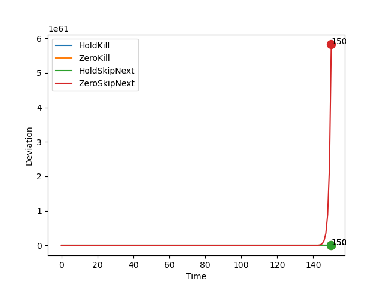
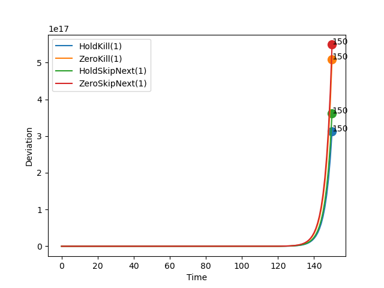
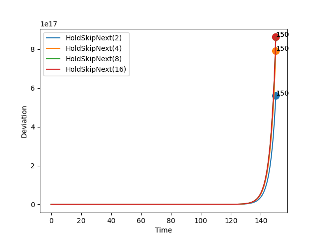
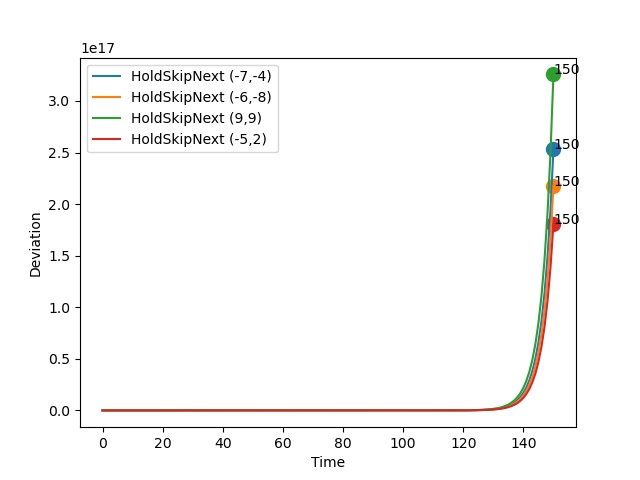

# Report: ECRTS-21

## Parameters

```sh
* Initial Set: [[10,10],[10,10]]
* Time Bound: 150
```

## Report: Using Uncertain Linear Systems

* Table



### Detailed Report

```sh
>> REPORT.	Method: ULS.	Policy:  HoldKill .
>> STATUS: Computing Reachable Sets . . .
	Time Taken:  9.286415338516235
>> STATUS: Reachable Sets Computed!
>> STATUS: Computing Deviations . . .
	Time Taken:  4.294870138168335
>> STATUS: Deviations Computed!
	Max Deviation:  3.875431136410593e+22 ;	 At time step:  150
	Total Time Taken:  13.608521699905396
>> End of Report!

-----------

>> REPORT.	Method: ULS.	Policy:  ZeroKill .
>> STATUS: Computing Reachable Sets . . .
	Time Taken:  8.350624799728394
>> STATUS: Reachable Sets Computed!
>> STATUS: Computing Deviations . . .
	Time Taken:  4.06915807723999
>> STATUS: Deviations Computed!
	Max Deviation:  167625734.65586782 ;	 At time step:  150
	Total Time Taken:  12.42193078994751
>> End of Report!

-----------

>> REPORT.	Method: ULS.	Policy:  HoldSkipAny .
>> STATUS: Computing Reachable Sets . . .
	Time Taken:  31.055190563201904
>> STATUS: Reachable Sets Computed!
>> STATUS: Computing Deviations . . .
	Time Taken:  10.038575410842896
>> STATUS: Deviations Computed!
	Max Deviation:  4.247347343653142e+47 ;	 At time step:  150
	Total Time Taken:  41.09636163711548
>> End of Report!

-----------

>> REPORT.	Method: ULS.	Policy:  ZeroSkipNext .
>> STATUS: Computing Reachable Sets . . .
	Time Taken:  33.09131479263306
>> STATUS: Reachable Sets Computed!
>> STATUS: Computing Deviations . . .
	Time Taken:  10.650840282440186
>> STATUS: Deviations Computed!
	Max Deviation:  5.823056092780334e+61 ;	 At time step:  150
	Total Time Taken:  43.745068311691284
>> End of Report!

-----------
```

## Report: Using Generalized Recurrence Relations

* Table
* Max Deadline Miss: 1



### Detailed Report

```sh
>> REPORT.	Method: Recurrence Relation.	Policy:  HoldKill .	Max Deadline Miss:  1
>> STATUS: Computing Reachable Sets . . .
	Time Taken:  0.20417547225952148
>> STATUS: Reachable Sets Computed!
>> STATUS: Computing Deviations . . .
	Time Taken:  0.3987703323364258
>> STATUS: Deviations Computed!
	Max Deviation:  3.1261950018276934e+17 ;	 At time step:  150
	Total Time Taken:  0.6261465549468994
>> End of Report!

-----------

>> REPORT.	Method: Recurrence Relation.	Policy:  ZeroKill .	Max Deadline Miss:  1
>> STATUS: Computing Reachable Sets . . .
	Time Taken:  0.21126461029052734
>> STATUS: Reachable Sets Computed!
>> STATUS: Computing Deviations . . .
	Time Taken:  0.3571434020996094
>> STATUS: Deviations Computed!
	Max Deviation:  5.08905854381013e+17 ;	 At time step:  150
	Total Time Taken:  0.5703480243682861
>> End of Report!

-----------

>> REPORT.	Method: Recurrence Relation.	Policy:  HoldSkipAny .	Max Deadline Miss:  1
>> STATUS: Computing Reachable Sets . . .
	Time Taken:  0.3312113285064697
>> STATUS: Reachable Sets Computed!
>> STATUS: Computing Deviations . . .
	Time Taken:  0.6258902549743652
>> STATUS: Deviations Computed!
	Max Deviation:  3.6197517195779014e+17 ;	 At time step:  150
	Total Time Taken:  0.9592220783233643
>> End of Report!

-----------

>> REPORT.	Method: Recurrence Relation.	Policy:  ZeroSkipNext .	Max Deadline Miss:  1
>> STATUS: Computing Reachable Sets . . .
	Time Taken:  0.32918500900268555
>> STATUS: Reachable Sets Computed!
>> STATUS: Computing Deviations . . .
	Time Taken:  0.615321159362793
>> STATUS: Deviations Computed!
	Max Deviation:  5.488563469540778e+17 ;	 At time step:  150
	Total Time Taken:  0.9466495513916016
>> End of Report!

-----------
```

## Report: Using Generalized Recurrence Relations on Hold-Skip-Next Varying Misses

* Comparing the effect of deadline misses



### Detailed Report

```sh
>> REPORT.	Method: Recurrence Relation.	Policy:  HoldSkipAny .	Max Deadline Miss:  2
>> STATUS: Computing Reachable Sets . . .
	Time Taken:  0.4832725524902344
>> STATUS: Reachable Sets Computed!
>> STATUS: Computing Deviations . . .
	Time Taken:  0.9236049652099609
>> STATUS: Deviations Computed!
	Max Deviation:  5.604461570947084e+17 ;	 At time step:  150
	Total Time Taken:  1.4290974140167236
>> End of Report!

-----------

>> REPORT.	Method: Recurrence Relation.	Policy:  HoldSkipAny .	Max Deadline Miss:  4
>> STATUS: Computing Reachable Sets . . .
	Time Taken:  0.7964930534362793
>> STATUS: Reachable Sets Computed!
>> STATUS: Computing Deviations . . .
	Time Taken:  1.6031839847564697
>> STATUS: Deviations Computed!
	Max Deviation:  7.926570499514811e+17 ;	 At time step:  150
	Total Time Taken:  2.4017937183380127
>> End of Report!

-----------

>> REPORT.	Method: Recurrence Relation.	Policy:  HoldSkipAny .	Max Deadline Miss:  8
>> STATUS: Computing Reachable Sets . . .
	Time Taken:  1.4722073078155518
>> STATUS: Reachable Sets Computed!
>> STATUS: Computing Deviations . . .
	Time Taken:  2.8343803882598877
>> STATUS: Deviations Computed!
	Max Deviation:  8.628221018728603e+17 ;	 At time step:  150
	Total Time Taken:  4.308793067932129
>> End of Report!

-----------

>> REPORT.	Method: Recurrence Relation.	Policy:  HoldSkipAny .	Max Deadline Miss:  16
>> STATUS: Computing Reachable Sets . . .
	Time Taken:  2.6516480445861816
>> STATUS: Reachable Sets Computed!
>> STATUS: Computing Deviations . . .
	Time Taken:  5.432049751281738
>> STATUS: Deviations Computed!
	Max Deviation:  8.628221018728603e+17 ;	 At time step:  150
	Total Time Taken:  8.086709022521973
>> End of Report!

-----------
```


## Report: Using Generalized Recurrence Relations on Hold-Skip-Next Varying Initial States

* Comparing the effect of initial sets.
* Max deadline: 1.



### Detailed Report

```sh
>> REPORT.	Method: Recurrence Relation.	Policy:  HoldSkipAny .	Max Deadline Miss:  1
>> STATUS: Computing Reachable Sets . . .
	Time Taken:  0.31138038635253906
>> STATUS: Reachable Sets Computed!
>> STATUS: Computing Deviations . . .
	Time Taken:  0.5974938869476318
>> STATUS: Deviations Computed!
	Max Deviation:  2.533424770754503e+17 ;	 At time step:  150
	Total Time Taken:  0.9317572116851807
>> End of Report!
Init Set:  -7 , -4

-----------

>> REPORT.	Method: Recurrence Relation.	Policy:  HoldSkipAny .	Max Deadline Miss:  1
>> STATUS: Computing Reachable Sets . . .
	Time Taken:  0.33505773544311523
>> STATUS: Reachable Sets Computed!
>> STATUS: Computing Deviations . . .
	Time Taken:  0.6161625385284424
>> STATUS: Deviations Computed!
	Max Deviation:  2.1722883685587453e+17 ;	 At time step:  150
	Total Time Taken:  0.9536399841308594
>> End of Report!
Init Set:  -6 , -8

-----------

>> REPORT.	Method: Recurrence Relation.	Policy:  HoldSkipAny .	Max Deadline Miss:  1
>> STATUS: Computing Reachable Sets . . .
	Time Taken:  0.32759761810302734
>> STATUS: Reachable Sets Computed!
>> STATUS: Computing Deviations . . .
	Time Taken:  0.6231324672698975
>> STATUS: Deviations Computed!
	Max Deviation:  3.25777654762012e+17 ;	 At time step:  150
	Total Time Taken:  0.9529314041137695
>> End of Report!
Init Set:  9 , 9

-----------

>> REPORT.	Method: Recurrence Relation.	Policy:  HoldSkipAny .	Max Deadline Miss:  1
>> STATUS: Computing Reachable Sets . . .
	Time Taken:  0.3278496265411377
>> STATUS: Reachable Sets Computed!
>> STATUS: Computing Deviations . . .
	Time Taken:  0.639307975769043
>> STATUS: Deviations Computed!
	Max Deviation:  1.8089391829055462e+17 ;	 At time step:  150
	Total Time Taken:  0.9693782329559326
>> End of Report!
Init Set:  -5 , 2

-----------
```

