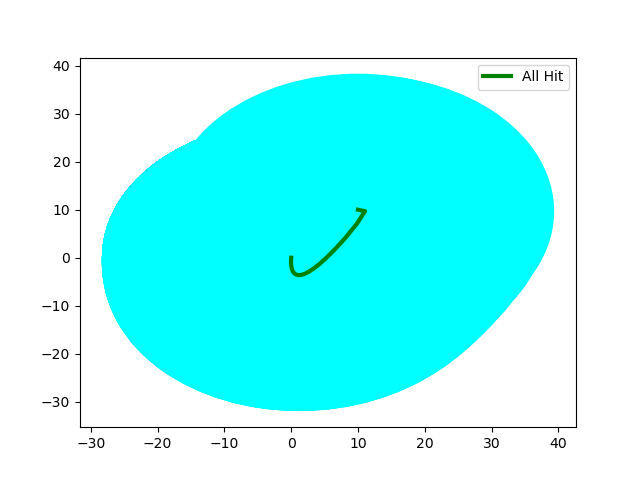

# RC Network

```shell
>> Starting Main Algo.	Sched Policy:  HoldSkip-Next .	Distro:  K-Miss .	Heuristic Used:  RandSampKMiss
	>> SUB-STATUS: Computing Initial d
	* d:  13.18374366233286
	* Time Taken:  1.5608327388763428
	>> SUB-STATUS: Initial d Computed!!

	>> SUB-STATUS: Refinement Starts . . .
	>> SUB-STATUS: Iteration Number:  0
>> STATUS: Statistically Verifying . . .
	* Hypothesis Accepted:  False
	* Time Taken:  23.896167278289795
>> STATUS: Statistically Verified!!
	>> SUB-STATUS: Iteration Number:  1
>> STATUS: Statistically Verifying . . .
	* Hypothesis Accepted:  True
	* Time Taken:  22.175347566604614
>> STATUS: Statistically Verified!!
	>> SUB-STATUS: Refinement End . . .
	* Time Taken:  47.66020131111145
	* Refinements Made:  1
	* Upper Bound d:  28.22528093791286
>> Main Algo Executed!!
```

