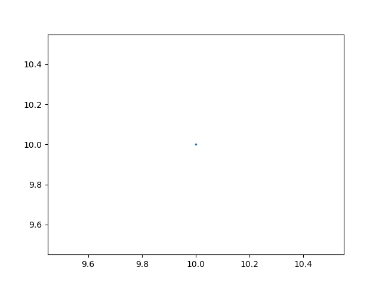

# Report

## Benchmark: DC Motor

* Initial Point = (10,10). Could have also started with a set.
* Time Steps = 150
* Policy: Hold and Skip-Next (any number of misses)

## Results:

```shell
>> STATUS: Computing Reachable Sets . . .
        Time Taken:  13.964749813079834
>> STATUS: Reachable Sets Computed!
```



