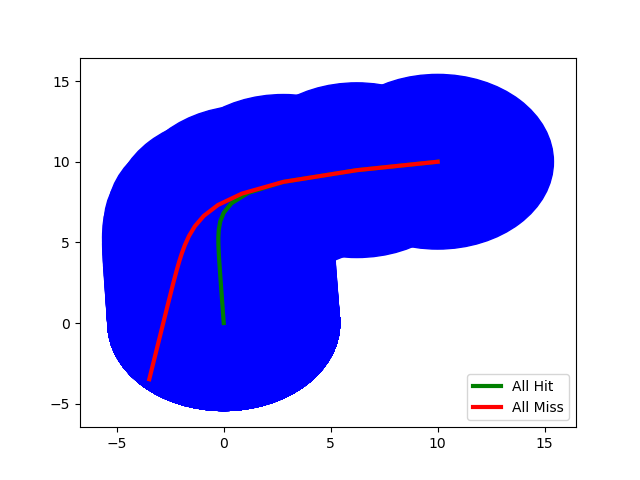

# RC Network

```shell
>> Starting Main Algo.	Sched Policy:  HoldSkip-Next .	Distro:  Uniform .	Heuristic Used:  RandSamp
	>> SUB-STATUS: Computing Initial d
	* d:  5.41455856371884
	* Time Taken:  0.012857437133789062
	>> SUB-STATUS: Initial d Computed!!

	>> SUB-STATUS: Refinement Starts . . .
	>> SUB-STATUS: Iteration Number:  0
>> STATUS: Statistically Verifying . . .
	* Hypothesis Accepted:  True
	* Time Taken:  0.7744252681732178
>> STATUS: Statistically Verified!!
	>> SUB-STATUS: Refinement End . . .
	* Time Taken:  0.7982978820800781
	* Refinements Made:  0
	* Upper Bound d:  5.41455856371884
>> Main Algo Executed!!
```

