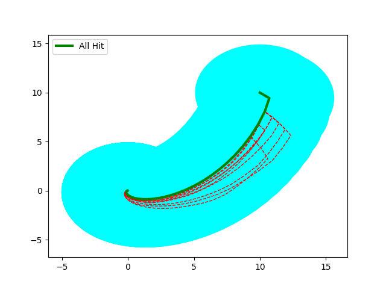

# RC Network

```shell
>> Starting Main Algo.	Sched Policy:  ZeroSkip-Next .	Distro:  K-Miss .	Heuristic Used:  RandSampKMiss
	>> SUB-STATUS: Computing Initial d
	* d:  3.8066609928441006
	* Time Taken:  1.3918437957763672
	>> SUB-STATUS: Initial d Computed!!

	>> SUB-STATUS: Refinement Starts . . .
	>> SUB-STATUS: Iteration Number:  0
>> STATUS: Statistically Verifying . . .
	* Hypothesis Accepted:  False
	* Time Taken:  21.149264574050903
>> STATUS: Statistically Verified!!
	>> SUB-STATUS: Iteration Number:  1
>> STATUS: Statistically Verifying . . .
	* Hypothesis Accepted:  True
	* Time Taken:  22.47159719467163
>> STATUS: Statistically Verified!!
	>> SUB-STATUS: Refinement End . . .
	* Time Taken:  45.03961133956909
	* Refinements Made:  1
	* Upper Bound d:  4.8828947779540925
>> Main Algo Executed!!
```

